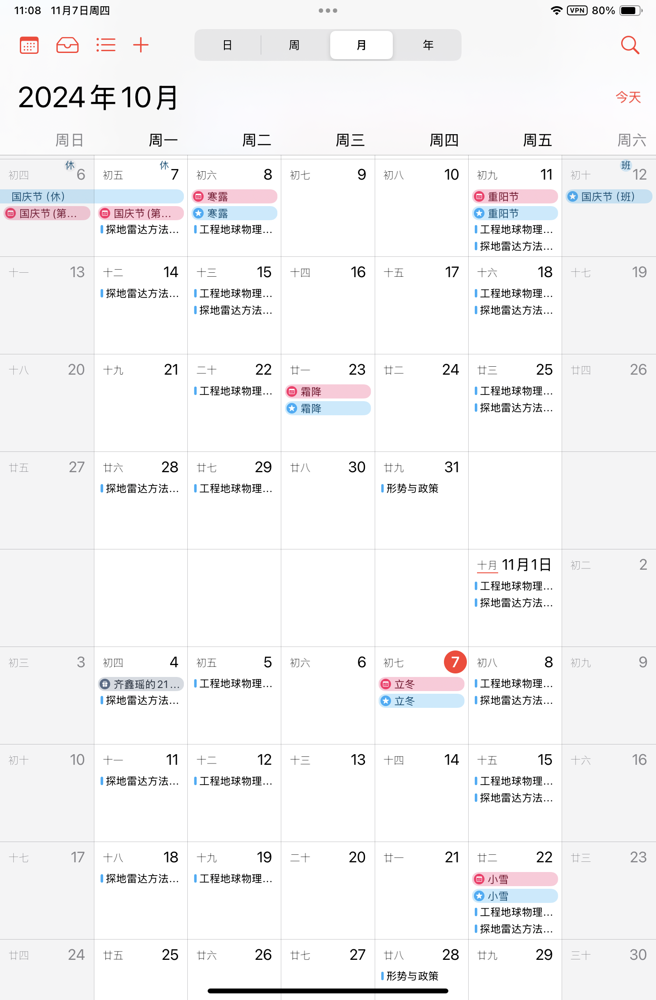
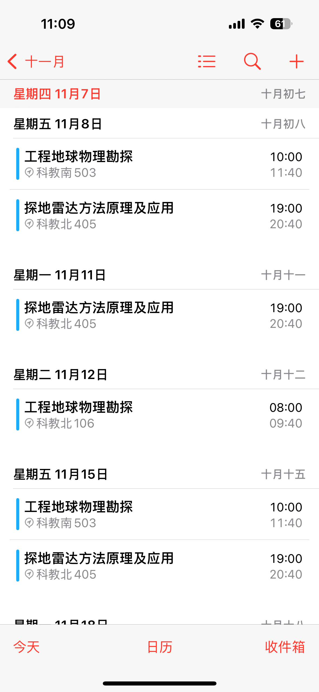
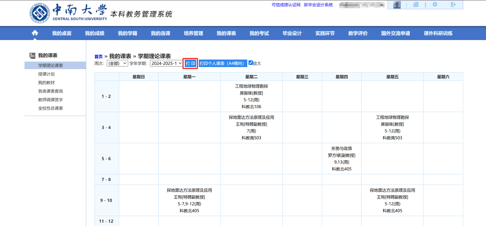
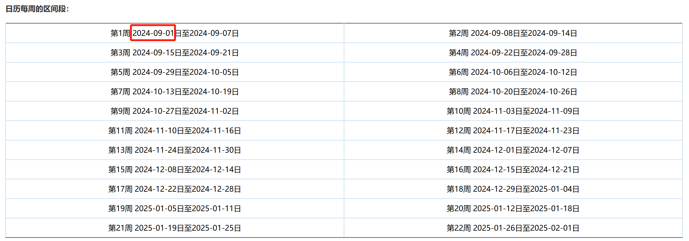

# CSU-Course-Schedule-2-ICS
将中南大学课程表解析并生成 iCalendar 文件（.ics），以便导入日历。

目前仅在 iOS/iPadOS 测试过。

使用第三方的课程表 APP 不是很优雅。
# 截图展示

|iPadOS 日历|iOS 日历|上课前通知|
|:---:|:---:|:---:|
||||


# 如何使用
1. 访问教务系统，点击“打印”下载课表（.xls格式）；



2. 在同一页面找到本学期的第一天的日期；



3. 克隆本仓库，安装所需模块：

```bash
git clone https://github.com/barkure/CSU-Course-Schedule-2-ICS.git

cd CSU-Course-Schedule-2-ICS

pip install -r requirements.txt
```

4. 修改 `create_ics.py` 相关内容，运行得到 `courses.ics` 文件，例如：

```python
# 假设学期开始日期为 2024 年 9 月 1 日
term_start = [2024, 9, 1]
courses = parse_courses(term_start, '学生个人课表_8211211224.xls')
courses_to_ics(courses)
```

5. 在日历导入刚刚获得的文件即可，不同日历软件各有差异，自己摸索。

# 导入示例

https://github.com/user-attachments/assets/626c4fbb-4057-4b84-8dc1-e276d87da164
